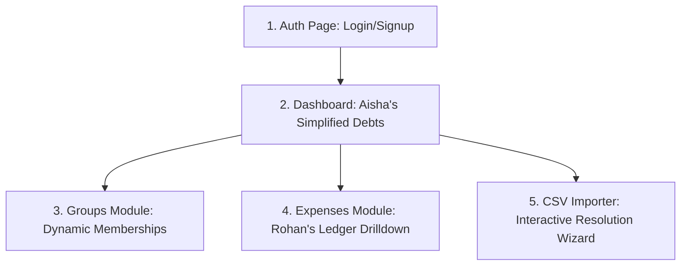
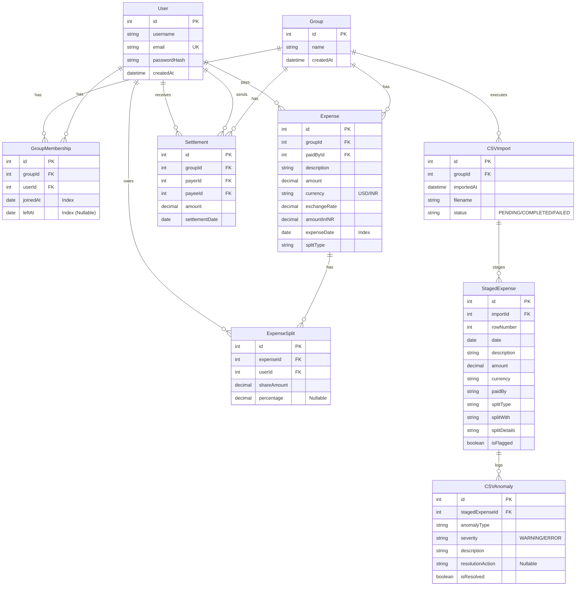

# Shared Expenses App: System Design & Architecture Specification

This document provides a comprehensive architectural blueprint of the application. It is structured into three main sections:
1. **Frontend Functionality & User Interface Flow**
2. **Backend System Design & Endpoint Logic (with pseudocode)**
3. **Database Schema & Relational Design**

---

## Part 1: Frontend Functionality & UI Flow

The React frontend utilizes **Tailwind CSS** for a clean, glassmorphic dark-mode interface. The user interface is broken down into five core modules:



### 1. Authentication Screens
* **Login Page**: A card layout prompting for Email and Password. Stores the JWT token in `localStorage` or a secure cookie upon success and redirects to the Dashboard.
* **Register Page**: Prompts for Username, Email, and Password. Creates a new user profile in PostgreSQL.

### 2. Main Dashboard
* **Net Balance Banner**: Shows a summary widget: `"You are owed ₹1,500"` (green) or `"You owe ₹1,200"` (red).
* **Aisha's Simplified Debt List**: A list of clean cards showing resolved balances:
  * *Example*: `[Aisha] owes [Rohan] ➜ ₹2,300` with a `[Settle]` button next to it.
* **Group Selection Dropdown**: Switch between different shared houses/trips.

### 3. Groups & Membership Module
* **Create Group Form**: Inputs for Group Name and initial members.
* **Membership Timeline Panel**: Shows a list of active and historic members with their joined and left dates:
  * *Example*: 
    * `Aisha (Joined: Feb 1, 2026 - Active)`
    * `Meera (Joined: Feb 1, 2026 - Left: Mar 29, 2026)`
    * `Sam (Joined: Apr 15, 2026 - Active)`
* **Manage Members Form**: Input fields to add a new user (with a join date) or "remove" an existing member (sets their leave date).

### 4. Expense Ledger (Rohan's Requirement)
* **Add Expense Modal**: Inputs for Description, Amount, Currency (USD/INR), Paid By, Date, Split Type (Equal, Unequal, Percentage, Share), and details.
* **Ledger View**: A list of all group expenses.
* **Audit Trail Drilldown**: Clicking on any expense expands it to show the calculation path:
  * *Example*:
    * **Description**: March Rent (₹48,000) on Mar 1, 2026
    * **Split Type**: Equal
    * **Payer**: Aisha
    * **Splits**:
      * *Aisha*: Share: ₹12,000 (25%)
      * *Rohan*: Share: ₹12,000 (25%)
      * *Priya*: Share: ₹12,000 (25%)
      * *Meera*: Share: ₹12,000 (25%)
      * *(Sam excluded: Joined in April)*

### 5. CSV Import Staging Wizard (Meera's Requirement)
* **Step 1: Upload**: File dropzone for `expenses_export.csv`.
* **Step 2: Analysis & Summary**: Shows a progress dashboard:
  * *“43 total rows parsed. 34 clean rows. 9 anomalies detected.”*
* **Step 3: Interactive Resolution Cards**: Renders cards side-by-side for each anomaly:
  * *Duplicate Warning*: Displays Row 5 (Dinner, ₹3200) and Row 6 (dinner, ₹3200). Buttons: `[Keep Row 5]`, `[Keep Row 6]`, `[Keep Both]`.
  * *Inactive Member Warning*: Displays Row 36 (Groceries, April 2nd) which includes Meera who left in March. Button: `[Remove Meera & Recalculate Splits]`, `[Keep Meera]`.
* **Step 4: Finalize**: Imports the resolved data into the core system and outputs the downloadable **Import Report**.

---

## Part 2: Backend Architecture & Endpoint Logic

The Express backend coordinates data validation, handles authentication sessions, processes CSV streams, and runs the expense split and simplification engines.

### 1. JWT Authentication Flow
We use JSON Web Tokens (JWT) for authentication to maintain a stateless, lightweight security model.


---

### 2. Detailed Endpoint Logic (Step-by-Step Backend Processes)

Here is the exact step-by-step logic you need to write for your Express handlers:

#### Endpoint A: User Registration (`POST /api/auth/register`)
1. **Receive Inputs**: Extract `username`, `email`, and `password` from `req.body`.
2. **Validate**:
   - Check if all fields are present.
   - Run email regex validation.
   - Verify if the `email` already exists in the `User` database table. If yes, return `400 Bad Request ("Email already registered")`.
3. **Hash Password**: Call `bcrypt.hash(password, 10)` to encrypt the password.
4. **Database Write**: Insert the new record into the `User` table (with the hashed password).
5. **Return**: Return `201 Created` with the new user's ID and username (never return the password hash).

#### Endpoint B: Adding an Expense (`POST /api/expenses`)
1. **Receive Inputs**: Extract `groupId`, `description`, `amount`, `currency`, `paidById`, `expenseDate`, `splitType`, and `splitDetails` from `req.body`.
2. **Authorize**: Verify that the authenticated user is currently a member of `groupId` using the `GroupMembership` table.
3. **Validate Splitting Math**:
   - Parse `expenseDate`.
   - Fetch the list of active members in the group on `expenseDate`.
   - If any user in `splitDetails` or `splitWith` is NOT active in the group on that date, throw `400 Bad Request` (Sam's rule).
   - If `splitType` is `percentage`, verify the percentages sum to exactly 100%.
   - If `splitType` is `share`, verify shares are positive.
4. **Exchange Rate Conversion**:
   - If `currency` is `"USD"`, retrieve the exchange rate for `expenseDate`. If not available, fetch from a caching exchange-rate service or default to a fixed rate (e.g., `83.0`).
   - Store both `amount` (in USD) and `amountInINR` (converted).
5. **Create Transactions (Database Write)**:
   - Start a Database Transaction:
     - Create an `Expense` record.
     - For each split participant, create an `ExpenseSplit` record containing their calculated share amount.
6. **Return**: `201 Created` with the created expense and split details.

---

### 3. Core Algorithms Logic

#### Algorithm A: CSV Upload & Anomaly Detection Ingestion
When a CSV file is uploaded, we run a validation pipeline. Below is the step-by-step logic for the engine:

```javascript
// Step-by-Step Logic for CSV Parser Ingestion
async function processCSV(fileBuffer, groupId) {
    // 1. Create a CSVImport session in the database (Status: PENDING)
    const importSession = await createCSVImportSession(groupId);
    
    // 2. Parse the buffer stream into JSON rows
    const rows = parseCSVBuffer(fileBuffer); 
    
    // 3. Keep a cache of all parsed rows to perform duplicate checks
    const parsedRows = []; 
    
    for (let index = 0; index < rows.length; index++) {
        const row = rows[index];
        const rowNum = index + 2; // CSV headers are line 1
        
        let hasAnomaly = false;
        let anomalyDetails = [];
        
        // CHECK 1: Missing Critical Fields
        if (!row.date || !row.description || !row.amount) {
            anomalyDetails.push({ type: "MISSING_DATA", severity: "ERROR", desc: "Missing Date, Description, or Amount." });
            hasAnomaly = true;
        }
        
        // CHECK 2: Duplicate Ingestion Check (Matches identical properties in the file)
        const duplicate = parsedRows.find(r => 
            r.date === row.date && 
            r.paid_by === row.paid_by && 
            Math.abs(parseFloat(r.amount) - parseFloat(row.amount)) < 0.01
        );
        if (duplicate) {
            anomalyDetails.push({ type: "DUPLICATE_ROW", severity: "WARNING", desc: `Duplicate of Row ${duplicate.rowNum} found.` });
            hasAnomaly = true;
        }
        
        // CHECK 3: Name Normalization (Lowercased checks, fuzzy aliases)
        const resolvedPayer = resolveUserAlias(row.paid_by); // Maps "Priya S" -> "Priya"
        if (!resolvedPayer) {
            anomalyDetails.push({ type: "INVALID_PAYER", severity: "ERROR", desc: `Payer "${row.paid_by}" does not exist in group.` });
            hasAnomaly = true;
        }

        // CHECK 4: Currency Checking
        if (!row.currency || row.currency.trim() === "") {
            anomalyDetails.push({ type: "MISSING_CURRENCY", severity: "WARNING", desc: "Currency was empty. Defaulted to INR." });
            hasAnomaly = true;
        }
        
        // CHECK 5: Negative Amounts (Refund Logic)
        const parsedAmount = parseFloat(row.amount.replace(/,/g, ''));
        if (parsedAmount < 0) {
            anomalyDetails.push({ type: "NEGATIVE_AMOUNT", severity: "WARNING", desc: "Negative amount detected. Treated as a group refund." });
            hasAnomaly = true;
        }
        
        // CHECK 6: Date Validation (Temporal scoping)
        const parsedDate = normalizeDate(row.date); // Converts "Mar-14" -> "2026-03-14"
        const activeMembers = await getActiveMembersOnDate(groupId, parsedDate);
        const splitParticipants = row.split_with.split(';');
        
        const invalidMembers = splitParticipants.filter(member => !activeMembers.includes(resolveUserAlias(member)));
        if (invalidMembers.length > 0) {
            anomalyDetails.push({ 
                type: "INACTIVE_MEMBER_SPLIT", 
                severity: "WARNING", 
                desc: `${invalidMembers.join(', ')} was split with but was inactive in the group on this date.` 
            });
            hasAnomaly = true;
        }
        
        // 4. Save to Database Staging Area
        const stagedExpense = await saveToStagingExpenseTable({
            importId: importSession.id,
            rowNumber: rowNum,
            date: parsedDate,
            description: row.description,
            amount: parsedAmount,
            currency: row.currency || "INR",
            paidBy: resolvedPayer,
            splitType: row.split_type || "equal",
            splitWith: row.split_with,
            splitDetails: row.split_details,
            isFlagged: hasAnomaly
        });
        
        // Save anomaly records linked to this staged row
        if (hasAnomaly) {
            for (const anomaly of anomalyDetails) {
                await saveToCSVAnomalyTable({
                    stagedExpenseId: stagedExpense.id,
                    anomalyType: anomaly.type,
                    severity: anomaly.severity,
                    description: anomaly.desc
                });
            }
        }
        
        // Push to temporary list for subsequent duplicate checks
        parsedRows.push({ ...row, rowNum });
    }
}
```

---

#### Algorithm B: Date-Scoped Active Split Calculations
To ensure Sam doesn't pay for March electricity (temporal logic), follow this logic:

```javascript
function calculateSplits(amount, expenseDate, splitType, splitParticipants, splitDetails, activeMemberships) {
    // 1. Filter participants down to active members only based on dates
    const eligibleParticipants = splitParticipants.filter(userId => {
        const membership = activeMemberships.find(m => m.userId === userId);
        if (!membership) return false;
        
        const joined = new Date(membership.joinedAt);
        const left = membership.leftAt ? new Date(membership.leftAt) : null;
        const targetDate = new Date(expenseDate);
        
        return joined <= targetDate && (!left || targetDate <= left);
    });
    
    // 2. Apply split math strategy
    let splits = []; // Array of { userId, shareAmount }
    
    if (splitType === "equal") {
        const count = eligibleParticipants.length;
        const rawShare = amount / count;
        
        // Rounding adjustment (Aisha/Rohan's math safety)
        const roundedShare = Math.round(rawShare * 100) / 100;
        const totalAllocated = roundedShare * count;
        const remainder = Math.round((amount - totalAllocated) * 100) / 100;
        
        eligibleParticipants.forEach((userId, idx) => {
            // Give the minor rounding remainder to the first participant (or payer)
            const share = idx === 0 ? roundedShare + remainder : roundedShare;
            splits.push({ userId, shareAmount: share });
        });
    }
    
    return splits;
}
```

---

#### Algorithm C: Debt Simplification (Minimizing Cash Flow)
Calculates Aisha's requested "simplified numbers" to reduce transactions:

```javascript
function simplifyDebts(userBalances) {
    // 1. Input: An array of user objects with net balances:
    // [{ userId: "Aisha", netBalance: 3000 }, { userId: "Rohan", netBalance: -1000 }, { userId: "Priya", netBalance: -2000 }]
    
    // 2. Separate into debtors (negative) and creditors (positive)
    let debtors = userBalances.filter(u => u.netBalance < 0).map(u => ({ ...u, netBalance: Math.abs(u.netBalance) }));
    let creditors = userBalances.filter(u => u.netBalance > 0);
    
    let transactions = []; // Output payments: { from, to, amount }
    
    // 3. Greedily match maximum debtor and maximum creditor
    while (debtors.length > 0 && creditors.length > 0) {
        // Sort lists to find max values
        debtors.sort((a, b) => b.netBalance - a.netBalance);
        creditors.sort((a, b) => b.netBalance - a.netBalance);
        
        const debtor = debtors[0];
        const creditor = creditors[0];
        
        // The transfer amount is the minimum of what debtor owes vs what creditor is owed
        const settlementAmount = Math.min(debtor.netBalance, creditor.netBalance);
        
        transactions.push({
            from: debtor.userId,
            to: creditor.userId,
            amount: Math.round(settlementAmount * 100) / 100
        });
        
        // Update balances
        debtor.netBalance -= settlementAmount;
        creditor.netBalance -= settlementAmount;
        
        // Remove settled users
        if (debtor.netBalance < 0.01) debtors.shift();
        if (creditor.netBalance < 0.01) creditors.shift();
    }
    
    return transactions; // Array of simplified debts
}
```

---

## Part 3: Relational Database Design

The schema enforces strict relational boundaries with explicit index optimization.



### Table & Relationship Constraints

1. **`GroupMembership` (Dynamic Timeline)**:
   - Contains dynamic dates `joinedAt` and `leftAt`.
   - **Composite Unique Constraint**: `(groupId, userId)` combined prevents a user from having overlapping membership records in the same group.
   
2. **`Expense` & `ExpenseSplit` (One-to-Many)**:
   - When an expense is deleted, splits are deleted in cascade (`ON DELETE CASCADE`).
   - `amountInINR` is stored on creation, preventing recalculation overhead during queries.

3. **`StagedExpense` & `CSVAnomaly`**:
   - The CSV import populates these staging tables first. Once Meera selects the resolutions, the app executes a transaction:
     1. Inserts verified rows into the main `Expense` and `ExpenseSplit` tables.
     2. Updates `CSVAnomaly` statuses to `isResolved = true`.
     3. Changes `CSVImport` status to `COMPLETED`.
